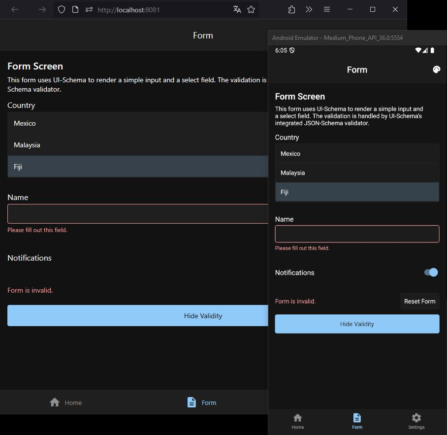

# UI-Schema React Native

Example app for [UI-Schema React](https://github.com/ui-schema/ui-schema) with [React Native](https://reactnative.dev/) and [Expo](https://expo.dev/).

Includes a custom UI-Schema binding with react-native `string`, `boolean` and `Select` widgets, and a basic multi-screen navigation structure. Check the [src/App.tsx](./src/App.tsx) file for the implementation details.

> [!NOTE]
>
> No experience with Expo/React Native. Without checking best practices or which packages/theme libraries exist.
>
> The Android and web preview and build were successful.



## Setup

First, clone the repository and navigate into the directory:

```bash
git clone https://github.com/ui-schema/demo-react-native.git
cd demo-react-native
```

Then install dependencies:

```bash
npm install
```

## Running the App

To run the app on your device or simulator:

```bash
npm start
```

To run the web version of the app:

```bash
npm run web
```

Or run the app on Android (you'll need to have an Android emulator or device connected):

```bash
npm run android
```

## Build the App

> For android/ios check the expo docs.

### Web

To build the web version of the app for deployment:

```bash
npx expo export -p web
```

This will create a `dist` directory containing the static web files.

You can run it with a basic `http` docker image like:

On unix:

```bash
docker run -p 8080:80 -v ${PWD}/dist:/usr/local/apache2/htdocs/ httpd:2.4
```

On windows:

```bash
docker run -p 8080:80 -v "%cd%/dist":/usr/local/apache2/htdocs/ httpd:2.4
```

## License

This project is licensed under the MIT License.
